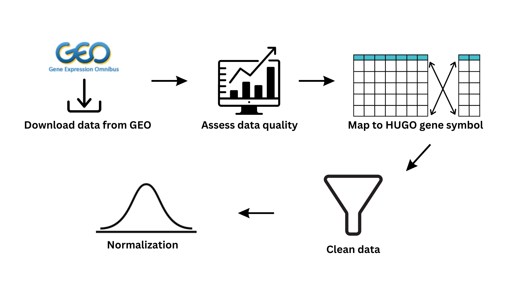

# Install and load required packages
```{r message=FALSE}
if (!require("BiocManager", quietly = TRUE))
  install.packages("BiocManager")
if (!require("org.Hs.eg.db", quietly = TRUE))
  BiocManager::install("org.Hs.eg.db")
if (!require("dplyr", quietly = TRUE))
  install.packages("dplyr")
if(!require("gprofiler2", quietly = TRUE))
  install.packages("gprofiler2")
if(!require("circlize", quietly = TRUE))
  install.packages("circlize")
library(dplyr)
library(org.Hs.eg.db)
library(ggplot2)
library(edgeR)
library(ComplexHeatmap)
library(circlize)
library(gprofiler2)
```

# Introduction to the data
The data set under investigation is from a GEO (Gene Expression Omnibus) 
[accession](https://www.ncbi.nlm.nih.gov/geo/query/acc.cgi?acc=GSE144474)
titled "Contribution of brain pericytes in blood-brain barrier (BBB)
formation and maintenance: A transcriptomic study of cocultured human 
endothelial cells derived from hematopoietic stem cells" [@data_paper]. 

The interaction of endothelial cells (ECs) and brain pericytes induces BBB 
characteristics in brain ECs during embryogenesis. Pericytes are a type of 
vascular cells embedded in the basement membrane, and is important for BBB 
functioning, so they can be used to differentiate stem cells into ECs and them 
BBB in vitro. However, the molecular events in BBB maturation are not fully 
understood.

# Preprocessing steps from Assignment 1

```{r echo=FALSE, fig.cap='Figure 1. This figure shows the data preprocessing steps that were already done (using R). The data was first downloaded from GEO. Then, simple statistics like finding the mean and standard deviation, and generating plots of gene counts, were done to assess data quality. Each gene was mapped to a HUGO gene symbol, from an ENTREZ gene symbol. Low quality reads were removed in the data cleaning step. Finally, normalization was carried out.'}


```

```{r message=FALSE, warning= FALSE, echo = FALSE, fig.show='hide'}
# load counts table from GEO
if (!("raw_counts_data.csv" %in% list.files())) {
  urld <- "https://www.ncbi.nlm.nih.gov/geo/download/?format=file&type=rnaseq_counts"
  path <- paste(urld, "acc=GSE144474", "file=GSE144474_raw_counts_GRCh38.p13_NCBI.tsv.gz", sep="&");
  raw_counts <- as.data.frame(data.table::fread(path, header=T, colClasses="integer"), rownames=1)
  
  # export data frame as csv file
  write.csv(raw_counts, "raw_counts_data.csv", row.names = FALSE)
} else {
  raw_counts <- read.csv("./raw_counts_data.csv")
}

Samples <- c("GeneID", "Solo_0h_Rep1", "Solo_0h_Rep2", "Solo_0h_Rep3",
             "Solo_48h_Rep1", "Solo_48h_Rep2", "Solo_48h_Rep3",
             "Solo_96h_Rep1", "Solo_96h_Rep2", "Solo_96h_Rep3",
             "HumanCC_24h_Rep1", "HumanCC_24h_Rep2", "HumanCC_24h_Rep3",
             "HumanCC_48h_Rep1", "HumanCC_48h_Rep2", "HumanCC_48h_Rep3",
             "HumanCC_96h_Rep1", "HumanCC_96h_Rep2", "HumanCC_96h_Rep3",
             "BovineCC_24h_Rep1", "BovineCC_24h_Rep2", "BovineCC_24h_Rep3",
             "BovineCC_48h_Rep1", "BovineCC_48h_Rep2", "BovineCC_48h_Rep3",
             "BovineCC_96h_Rep1", "BovineCC_96h_Rep2", "BovineCC_96h_Rep3")

Samples <- factor(Samples, levels = unique(Samples))


colnames(raw_counts) <- Samples

# Calculate and plot read counts per sample
read_counts <- as.data.frame(colSums(raw_counts))
colnames(read_counts) <- c("Reads")
read_counts <- subset(read_counts, rownames(read_counts) != "GeneID")
read_counts$Samples <- row.names(read_counts)

# Plot read counts per sample
ggplot2::ggplot(read_counts, aes(x=Samples, y=Reads))+
   geom_bar(stat = "identity") + 
   theme(axis.text.x = element_text(angle = 45, hjust = 1))

# Calculate and plot genes per sample
gene_counts <- as.data.frame(colSums(raw_counts > 0))
colnames(gene_counts) <- c("Genes")
gene_counts <- subset(gene_counts, rownames(gene_counts) != "GeneID")
gene_counts$Samples <- row.names(gene_counts)

# Plot genes per sample
ggplot2::ggplot(gene_counts, aes(x=Samples, y=Genes)) +
   geom_bar(stat = "identity") +
   theme(axis.text.x = element_text(angle = 45, hjust = 1))

# Map to HUGO genes

# an object from org.Hs.EgSYMBOL that contains all mapping from entrez ID to 
# HUGO symbol
x <- org.Hs.egSYMBOL
mapped_genes <- mappedkeys(x)
mapping <- as.data.frame(x[mapped_genes])

# change column name and data type to join
colnames(mapping)[1] <- "GeneID"
mapping$GeneID <- as.integer(mapping$GeneID)

# using left_join will result in NA for genes that cannot be mapped and retain
# the original data set
mapped_data <- dplyr::left_join(raw_counts, mapping, by = "GeneID")

unmapped_data <- subset(mapped_data, is.na(symbol))

mapped_data <- subset(mapped_data, !is.na(symbol))

# Find genes mapped to the same HUGO ID
duplicated_symbols <- mapped_data$symbol[duplicated(mapped_data$symbol)]

# Only keep the first one
mapped_data <- mapped_data[!duplicated(mapped_data$symbol), ]

# Set HUGO ID as rownames and remove unnecessary columns
rownames(mapped_data) <- mapped_data$symbol
mapped_data <- subset(mapped_data, select=c(-GeneID, -symbol))

#Remove genes with low read counts

# Filter out genes with low read counts
min_num_samples <- 3
data_mtx <- as.matrix(mapped_data)
# get rid of low counts
keep = rowSums(edgeR::cpm(data_mtx) > 1) > min_num_samples
filtered_data_mtx = data_mtx[keep,]

unmapped_data <- subset(unmapped_data, select = c(-symbol))
unmapped_mtx <- as.matrix(unmapped_data)
keep = rowSums(edgeR::cpm(unmapped_mtx) > 1) > min_num_samples
unmapped_filtered_mtx <- unmapped_mtx[keep,]

# Normalization
condition_names <- factor(c("Solo_0h", "Solo_0h", "Solo_0h", 
                            "Solo_48h", "Solo_48h", "Solo_48h",
                            "Solo_96h", "Solo_96h", "Solo_96h",
                            "HumanCC_24h", "HumanCC_24h", "HumanCC_24h",
                            "HumanCC_48", "HumanCC_48", "HumanCC_48",
                            "HumanCC_96h", "HumanCC_96h", "HumanCC_96h",
                            "BovineCC_24h", "BovineCC_24h", "BovineCC_24h",
                            "BovineCC_48h",  "BovineCC_48h",  "BovineCC_48h",
                            "BovineCC_96h", "BovineCC_96h", "BovineCC_96h"))
dge <- edgeR::DGEList(counts = filtered_data_mtx, group = condition_names)
dge_normalized <- edgeR::calcNormFactors(dge)
normalized_df <- edgeR::cpm(dge_normalized)

counts_density <- apply(log2(normalized_df), 2, density)
density_df <- do.call(rbind, lapply(seq_along(counts_density), function(i) {
  data.frame(
    x = counts_density[[i]]$x,
    y = counts_density[[i]]$y,
    sample = colnames(normalized_df)[i]
  )
}))

# Create ggplot with density plots for each sample
ggplot2::ggplot(density_df, aes(x = x, y = y, color = sample)) +
  geom_line() +
  labs(x = "Log2(Gene Counts)", y = "Density", color = "Samples") +
  theme_minimal()

# Combine replicates using average
condition_names <- c("Solo_0h", "Solo_48h", "Solo_96h", 
                "HumanCC_24h", "HumanCC_48", "HumanCC_96h", 
                "BovineCC_24h", "BovineCC_48h", "BovineCC_96h")
averaged_df <- c()

for (i in seq_along(condition_names)) {
  end_col <- i * 3
  start_col <- end_col - 2
  averaged_df <- cbind(averaged_df, rowMeans(normalized_df[,start_col:end_col]))
}
colnames(averaged_df) <- condition_names

```

# Differential gene expression analysis

## Revisit MDS to select factors
Firstly, we will plot MDS (Multidimensional scaling) using different groupings to determine which grouping to use for our differential gene expression analysis.


```{r, fig.show='hide'}
# Import normalized gene counts
normalized_df <- averaged_df
mds <- edgeR::plotMDS.DGEList(normalized_df)
```

For the first MDS plot, we grouped data using the time-points at which the samples were sequenced and generated the plot using edgeR [@edgeR_ref]. To plot the
MDS with the time-points as groups, we used limma [@limma_ref].

```{r fig.cap="Figure 2. MDS plot of normalized counts, grouped by timepoint. The x-axis represents the leading log-fold change (logFC) in the first dimension and the y-axis represents the leading logFC in the second dimension. The data points from the same timepoint are spread far apart, and don't cluster near each other."}
# Group by time-point
group2 <- factor(c("0h", "48h", "96h", rep(c("24h", "48h", "96h"), 2)))
col <- as.numeric(group2)
limma::plotMDS(mds, col=col, pch=16, main="MDS Plot grouped by timepoint")

par(xpd=NA)
legend("bottomright", legend=levels(group2), col=1:length(levels(group2)), pch=16, title="Timepoint")
```

For the second MDS plots, we will group the data by treatment. The three treatments are Solo, HumanCC and BovineCC, which represents epithelial cells (ECs) cultured solo, ECs cultured with human brain pericytes, and ECs cultured with bovine brain pericytes, respectively.

```{r fig.cap="Figure 3. MDS plot of normalized counts, grouped by treatment. The x and y axes represent the same values as in Figure 1. The data points of the same treatments are plotted relatively close to each other and don't mix with other treatments."}
# Group by treatment
group <- factor(c(rep("Solo", 3), rep("HumanCC", 3), rep("BovineCC", 3)))
col <- as.numeric(group)
limma::plotMDS(mds, col=col, pch=16, main="MDS Plot grouped by treatment")
legend(x="bottomright", legend=levels(group), col=1:length(levels(group)), 
       pch=16, title="Treatment", inset=c(-0.015, 0))
```

## Conduct DEG analysis
We performed differential expression analysis using the edgeR pipeline. First,
we created the design of the model using the treatment factor. We estimated 
dispersion using the design. Since we want to compare the control group (Solo-cultured ECs) to the other two groups, we created an aggregated contrast. Then we fit the data with the Quasi likelihood model.

```{r}
# Design model
group <- factor(group, levels = c("Solo", "HumanCC", "BovineCC"))
design <- model.matrix(~ group)

processed_counts <- as.matrix(normalized_df)
d <- edgeR::DGEList(counts = processed_counts, group = group)

# Estimate dispersion
dge <- edgeR::estimateDisp(d, design)


aggregate_contrast <- makeContrasts(
  contrast_name = Intercept - (groupHumanCC + groupBovineCC),
  levels = design
)

# Fit the model
fit <- edgeR::glmQLFit(dge, design)

# Calculate differential expression using Quasi likelihood model
qlf_treatment <- edgeR::glmQLFTest(fit)

# Get all output rows
qlf_all <- edgeR::topTags(qlf_treatment, 
                          sort.by = "PValue", 
                          n = nrow(processed_counts))
```

## Genes that pass threshold p-value < 0.05
```{r}
nrow(qlf_all$table[qlf_all$table$PValue < 0.05, ])
```
## Genes that are significantly differentially expressed
```{r}
nrow(qlf_all$table[abs(qlf_all$table$logFC) > 0.7 & qlf_all$table$PValue < 0.05, ])
```

## Genes that pass correction
```{r}
nrow(qlf_all$table[qlf_all$table$FDR < 0.05, ])
```

## Plot DEG with volcano plot

We visualized the differentially expressed genes using a volcano plot. The genes
are first sorted into 3 groups: up-regulated, down-regulated, and not
differentially expressed. Genes with log fold change higher than 0.7 and
p-value lower than 0.05 are up-regulated, genes with log fold change lower than
0.7 and p-value lower than 0.05 are down-regulated. The rest are not
not differentially expressed.

The top 5 up and down regulated genes are labeled.

```{r, warning=FALSE, fig.cap="Figure 4. Volcano plot of differentially expressed genes. Each dot represents a gene. Genes that are down-regulatedare  represented by pink dots. Genes that are up-regulated are represented by blue dots. Green dots represent genes that are not differentially expressed. The top five up and down regulated genes are labeled with the gene name."}

qlf_all$table$DiffExpressed <- "NO"

# If log2Foldchange > 0.6 and pvalue < 0.05, set as "UP" 
qlf_all$table$DiffExpressed[qlf_all$table$logFC > 0.7 & 
                              qlf_all$table$PValue < 0.05] <- "UP"

# If log2Foldchange < -0.6 and pvalue < 0.05, set as "DOWN" 
qlf_all$table$DiffExpressed[qlf_all$table$logFC < -0.7 & 
                              qlf_all$table$PValue < 0.05] <- "DOWN"

# Top differential expressed genes
top_up_5 <- qlf_all$table[qlf_all$table$logFC > 0.7 & 
                              qlf_all$table$PValue < 0.05, ] %>%
  arrange(desc(logFC)) %>%
  head(5)
top_down_5 <- qlf_all$table[qlf_all$table$logFC < -0.7 & 
                              qlf_all$table$PValue < 0.05, ] %>%
  arrange(logFC) %>%
  head(5)

top_DE <- rbind(top_up_5, top_down_5)

# Add labels for top differential expressed genes
top_DE$DElabel <- rownames(top_DE)
top_DE$DElabel

# merged_df has a column DElabel where only the top differentially
# expressed genes have a value (which is the gene name), other wise
# it is NA
merged_df <- merge(qlf_all$table, top_DE, all.x = TRUE)

# Plot volcano
ggplot(merged_df, aes(x=logFC,
                      y=-log10(PValue), 
                      col=DiffExpressed,
                      label=DElabel)) + 
  geom_point() + 
  theme_minimal() + 
  geom_text(nudge_y = 0.2, show.legend = FALSE)
```

## Heatmap

To visualize the relative expression levels of genes across all treatments, 
we used the ComplexHeatmap package to generate a heatmap [@complexheatmap_ref]. 
We only consider genes that are statistically significant, meaning the have p-values
less than 0.05. The expression matrix was scaled to prevent outliers to dominate
the heatmap, to allow for better comparisons. We used the package circlize to
create the color gradients [@circlize_ref].

```{r fig.cap="Figure 5. Heatmap illustrating the relative expression levels of  statisitcally significant genes across different treatments. Each row represents a gene, while each column represents a sample. The color intensity reflects the expression level of each gene, with red indicating higher expression and blue indicating lower expression. This heatmap provides a visual representation of gene expression patterns and potential relationships between genes and experimental conditions."}
# Get only the genes that are statistically significant
top_hits <- rownames(qlf_all$table)[qlf_all$table$PValue<0.05]

# Get the rows of top genes
heatmap_matrix_top_genes <- normalized_df[which(rownames(normalized_df) %in% top_hits),]

top_hits_scaled <- t(scale(t(heatmap_matrix_top_genes)))

if(min(top_hits_scaled) == 0) {
  heatmap_col = circlize::colorRamp2(c(0, 
                                       max(top_hits_scaled)),
                                     c("white", "red"))
} else {
  heatmap_col = circlize::colorRamp2(c(min(top_hits_scaled), 
                                       0, 
                                       max(top_hits_scaled)),
                                     c("blue", "white", "red"))
}

current_heatmap <- ComplexHeatmap::Heatmap(as.matrix(top_hits_scaled),
                                           heatmap_legend_param = list(
                                             title = "Scaled expression"),
                                           show_row_dend = TRUE,
                                           show_column_dend = TRUE,
                                           col = heatmap_col,
                                           show_column_names = TRUE,
                                           show_row_names = FALSE,
                                           show_heatmap_legend = TRUE)
current_heatmap
```

# Thresholded over-representation analysis

In order to do enrichment analysis, we first filter out the differentially
expressed genes. We decided the threshold to be logFC larger than 0.7, so we
avoid missing weaker signals. Then, we used G:profiler2 to annotate the data
using Gene Ontology Biological Processes as our data source [@gprofiler_ref].
The correction method we selected was FDR.

## Enrichment analysis of up and down-regulated genes combined

```{r}
DEG_genes <- rownames(qlf_all$table)[abs(qlf_all$table$logFC) > 0.7 &
                                       qlf_all$table$PValue < 0.05]
gprofiler_combined <- gprofiler2::gost(query = DEG_genes,
                          significant=FALSE,
                          ordered_query = FALSE,
                          exclude_iea=TRUE,
                          correction_method = "fdr",
                          organism = "hsapiens",
                          evcodes = TRUE,
                          source = c("GO:BP"))
enrichment_combined <- gprofiler_combined$result
```

```{r fig.cap="Figure 6. Bar plot illustrating the enriched Gene Ontology Biological Processes (GO:BP) terms associated with differentially expressed genes. Each bar represents a GO:BP term, and the length of each bar indicates the significance of the enrichment, which is -log_10(p-value). The intensity of color in each bar represents the number of genes in the data set that are considered in that biological process. The enchriched GO:BP terms provide insights into the biological processes that are overrepresented among the differentially expressed genes."}
barplot_combined <- ggplot(head(enrichment_combined, 10), aes(x = term_name, 
                                                  y = -log10(p_value),
                                                  fill = intersection_size)) +
  geom_bar(stat = "identity") +
  scale_fill_gradientn(colors = c("white", "blue")) +
  labs(x = "Process Name", y = "-log10(p-value)", fill = "Gene count") +
  theme(axis.text.x = element_text(angle = 45, hjust = 1)) +
  ggtitle("Enriched processes in differentially expressed genes") +
  coord_flip()
barplot_combined
```

## Enrichment analysis of up and down-regulated genes separated

We separated the up and down-regulated genes and ran the same enrichment 
analysis on each of them separately. 

```{r}
# Separate the up and down-regulated genes
up_genes <- rownames(qlf_all$table)[qlf_all$table$logFC > 0.7 & 
                          qlf_all$table$PValue < 0.05]
down_genes <- rownames(qlf_all$table)[qlf_all$table$logFC < -0.7 & 
                              qlf_all$table$PValue < 0.05]

# Run gprofiler with Gene Ontology: Biological Processes as 
# the data source, for up-regulated genes
gprofilers_up <- gprofiler2::gost(query = up_genes,
                          significant=FALSE,
                          ordered_query = FALSE,
                          exclude_iea=TRUE,
                          correction_method = "fdr",
                          organism = "hsapiens",
                          evcodes = TRUE,
                          source = c("GO:BP"))
enrichment_up <- gprofilers_up$result

# Now run the same analysis but for down-regulated genes
gprofilers_down <- gprofiler2::gost(query = down_genes,
                          significant=FALSE,
                          ordered_query = FALSE,
                          exclude_iea=TRUE,
                          correction_method = "fdr",
                          organism = "hsapiens",
                          evcodes = TRUE,
                          source = c("GO:BP"))
enrichment_down <- gprofilers_down$result
```


```{r fig.cap="Figure 7. Bar plot illustrating the enriched Gene Ontology Biological Processes (GO:BP) terms associated with up-regulated genes. Each bar represents a GO:BP term, and the length of each bar indicates the significance of the enrichment, which is -log_10(p-value). The intensity of color in each bar represents the number of genes in the data set that are considered in that biological process."}
barplot_up <- ggplot2::ggplot(head(enrichment_up, 10), aes(x = term_name, 
                                                           y = -log10(p_value),
                                                           fill = intersection_size)) +
  geom_bar(stat = "identity") +
  scale_fill_gradientn(colors = c("white", "blue")) +
  labs(x = "Process Name", y = "-log10(p-value)", fill = "Gene count") +
  theme(axis.text.x = element_text(angle = 45, hjust = 1)) +
  ggtitle("Up-regulated Processes") +
  coord_flip()
barplot_up
```

```{r fig.cap="Figure 8. Bar plot illustrating the enriched Gene Ontology Biological Processes (GO:BP) terms associated with down-regulated genes. Each bar represents a GO:BP term, and the length of each bar indicates the significance of the enrichment, which is -log_10(p-value). The intensity of color in each bar represents the number of genes in the data set that are considered in that biological process."}

barplot_down <- ggplot2::ggplot(head(enrichment_down, 10), aes(x = term_name, 
                                                               y = -log10(p_value),
                                                               fill = intersection_size)) +
  geom_bar(stat = "identity") +
  scale_fill_gradientn(colors = c("white", "blue")) +
  labs(x = "Process Name", y = "-log10(p-value)", fill = "Gene count") +
  theme(axis.text.x = element_text(angle = 45, hjust = 1)) +
  ggtitle("Down-regulated Processes") +
  coord_flip()
barplot_down
```

# Report questions

## Differential gene expression
1. Calculate p-values for each of the genes in your expression set. How many genes were significantly differentially expressed? What thresholds did you use and why?
- 185 genes were significantly differentially expressed. I used p-values less than 0.05 to determine if they are significant, and log-fold change > 0.6 or < -0.6 to determine whether they are differentially expressed. I think the logFC threshold ensures that we can pick up on weaker signals.

2. Multiple hypothesis testing - correct your p-values using a multiple hypothesis correction method. Which method did you use? And Why? How many genes passed correction?
- I used the FDR (false discovery rate) method to correct my p-values. It is a common method to use, and is very reliable. Only 7 genes passed correction.

3. Show the amount of differentially expressed genes using an MA Plot or a Volcano plot. Highlight genes of interest.
- The differentially expressed genes are shown in green and pink, and the top 5 up and downregulated genes are labelled.

4. Visualize your top hits using a heatmap. Do you conditions cluster together?
Explain why or why not.
- Yes, the conditions appear to cluster together. The solo-cultured ECs cluster 
together, and the remaining conditions cluster together. This is because the 
solo sample across all timepoints have similar genes that are highly expressed. 
In constrast, many genes that are not highly expressed in the solo samples are 
highly expressed in the cocultured samples.

## Thresholded over-representation analysis
1. Which method did you choose and why?
- I used gprofiler, which uses the hypergeometric test to evaluate the functional enrichment of the gene list. It is robust, especially with small samples, and is easy to interpret. It is also very computationally efficient.

2. What annotation data did you choose and why? What version of the annotation
are you using?
- I am using Gene Ontology (Biological Process) annotations. It is one of the 
more well-documented and frequently updated annotations. I also find it easy
to understand and interpret. The version I used is the 2024-01-17 release.

3. How many genesets were returned with what thresholds? 
- To get the differentially expressed genes, the thresholds I used were 
abs(logFC) > 0.07
and p-value < 0.05. For gprofiler, the used the FDR correction method. 
A total of 2883 genesets were returned, but only 72 were labelled significant 
(p-value < 0.05).

4. Run the analysis using the up-regulated set of genes, and the down-regulated 
set of genes separately. How do these results compare to using the whole list 
(i.e all differentially expressed genes together vs. the up-regulated and down 
regulated differentially expressed genes separately)?
- When running the analysis using the combined set of genes, the most significant
terms that were returned had higher gene count, but were very general, 
such as "developmental process", "response to stimulus", and "circulation 
process". When they were analyzed separately, more specific terms were provided,
which provides more information on the processes that were up or down-regulated.


# Interpret results
According to the original paper, interaction of endothelial cells and brain 
pericytes can induce blood-brain barrier characteristics in brain endothelial 
cells during embryogenesis. The study determined only a small percentage of 
genes were differentially expressed when comparing solo-cultured and co-cultured
ECs. They noted that ACKR1 (Duffy antigen receptor) gene is enriched in the 
co-cultured samples at all time points. ACKR1 is involved in the secretion of 
CXCL1 proteins by pericytes. The reason behind this has to be studied further.
```{r}
"ACKR1" %in% up_genes
"BMPER" %in% down_genes
```
In my analysis, I did observe ACKR1 as one of the differentially expressed genes
that are most highly expressed in the co-cultured samples. BMPER (BMP binding 
endothelial regulator) was one of the highly expressed genes in the 
solo-cultured samples in the original study, which was also observed in my 
analysis. 

In my analysis, SLCO1C1, SLCO2A1, SLCO5A1, which are solute carrier transporter 
genes, and ABCA1, an ATP transporter gene, are highly expressed in the 
co-cultured samples. Transporters are crucial for the transportation of glucose 
and other solutes in the BBB. The high expression of SLCO2A1, a glucose 
transporter, and ABCA1, suggests that there is a high demand for ATP, which is 
likely for BBB development [@Langen_ref]. 
```{r}
c("SLCO1C1", "SLCO2A1", "SLCO5A1", "NOTCH3", "ABCA1") %in% up_genes
```
NOTCH3, a gene involved in Notch signaling, is also overexpressed in my 
analysis. Notch signaling is one of the pathways involved in BBB development, 
since it is an important method of communication of ECs [@Saili_ref]. 
According to the annotations data, cell-matrix adhesion and cell-adhesion are 
two processes that are up-regulated in co-cultured cells. This is supported by 
the formation of tight junctions during BBB development. The overexpression of 
CDH15, an adherens junction marker, in co-cultured cells suggests that tight 
junctions have started to form [@Saili_ref]. 
